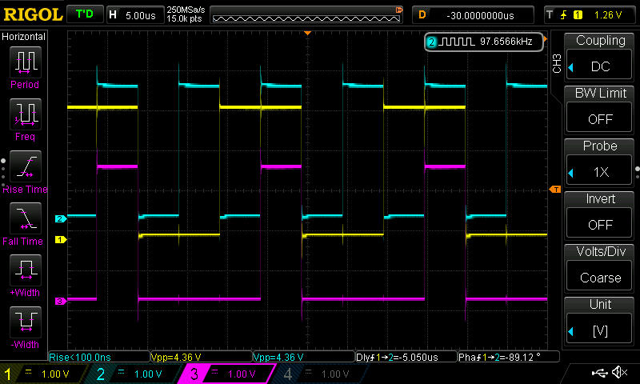
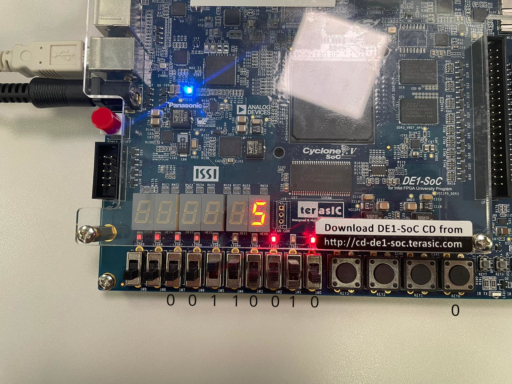
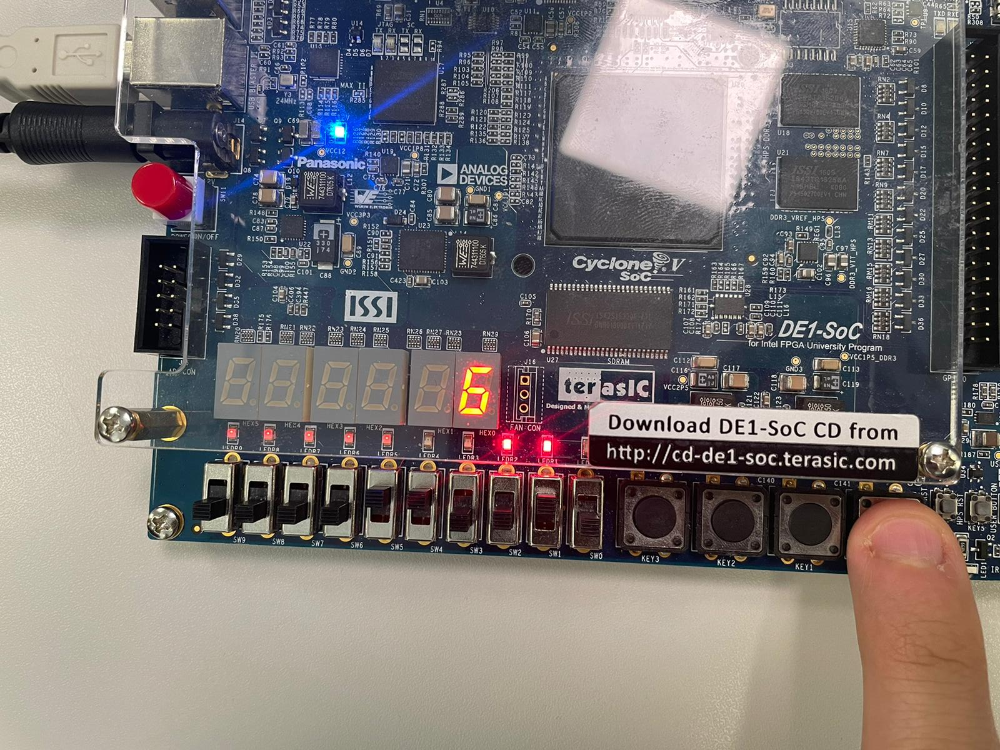
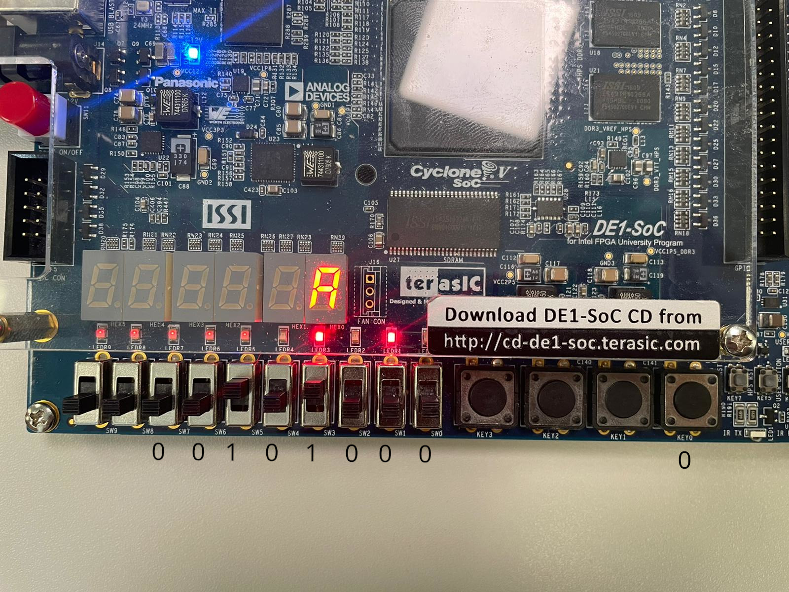
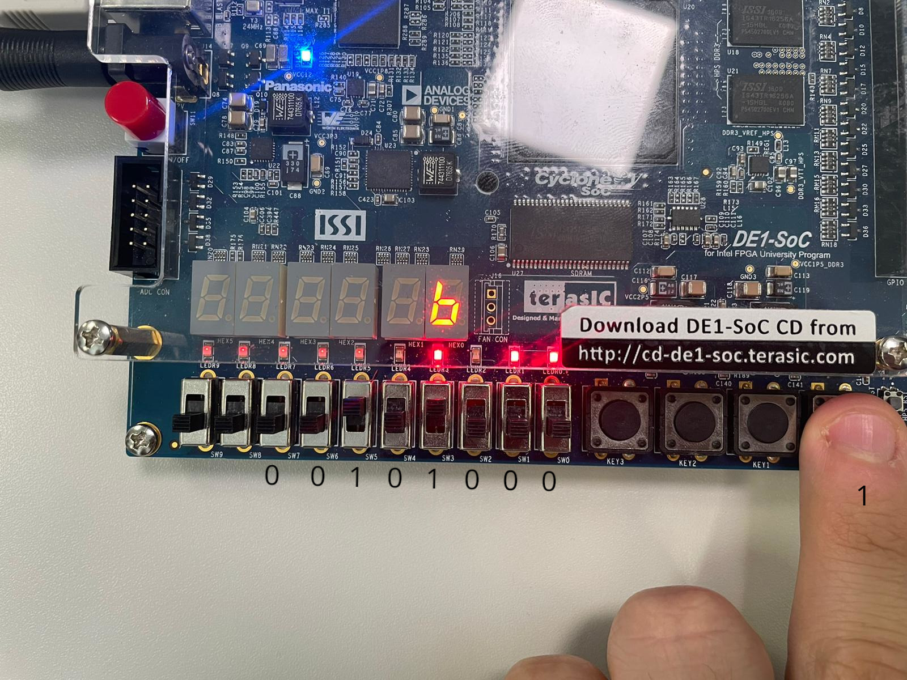
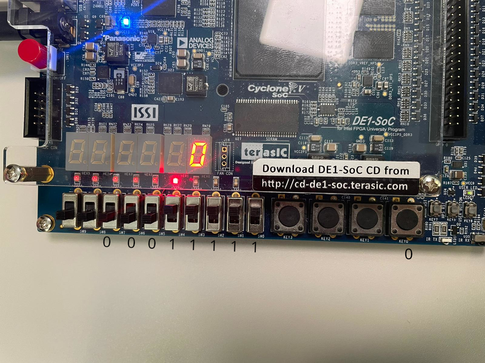

# Electronics for embedded systems - Group 02

> Gabriele Sanna 324140  
> Giulia Solito 329160  
> Ribaudo Alessandro 283309  
> Rong Zhu 327239  

## Laboratory 1

### Project 1: AND gate

#### file `lab1_1_efes.vhd`:
```vhdl
library ieee;
use ieee.std_logic_1164.all;


entity lab1_1_efes is
port (
	SW : in std_logic_vector(1 downto 0);
	LEDR : out std_logic_vector(0 downto 0)
);
end entity;

architecture behavior of lab1_1_efes is
begin
	LEDR(0) <= SW(0) and SW(1);
end architecture;
```

#### file `tb.vhd`:
```vhdl
library ieee;
use ieee.std_logic_1164.all;

entity tb is
end entity;

architecture behavior of tb is
	component lab1_1_efes
	port (
		A, B: in std_logic;
		C : out std_logic
	);
	end component;

	signal A, B, C: std_logic;
begin


	and_port: lab1_1_efes PORT MAP(
		A => A,
		B => B,
		C => C
	);

	values_process: process is
	begin
		A <= '1';
		B <= '1';
		wait for 20 ns;
		A <= '0';
		B <= '1';
		wait for 20 ns;
		A <= '0';
		B <= '0';
		wait for 20 ns;
		A <= '1';
		B <= '0';
		wait for 20 ns;
	end process values_process;
end architecture;
```

#### Code explanation:
In this project we designed an AND gate. The input signals are the first two switches of the board, and the output signal is displayed on the first LED. 

#### Timing analisys:

| Input 1 pin | Input 2 pin | Output pin | Constraint $t_{pd}$ | Worst case $t_{pd}$ |
| ----------- | ----------- | ---------- | ------------------- | ------------------- |
| 1           | 2           | 3          | 4                   | 5                   |
| 1           | 2           | 3          | 4                   | 5                   |
| 1           | 2           | 3          | 4                   | 5                   |

blablabla

### Project 2: 10 bit counter

#### file `lab1_2_efes.vhd`:
```vhdl
library ieee;
use ieee.std_logic_1164.all;
use ieee.numeric_std.all;

entity lab1_2_efes is
 port(
	CLOCK_50: in std_logic;
	GPIO_0: out std_logic_vector(2 downto 0);
	KEY: in std_logic_vector(0 DOWNTO 0)
 );
end entity;

architecture behaviour of lab1_2_efes is

signal A, B, C, resn, clk: std_logic;

component counter_10bits  
 port(
	cnt : buffer unsigned(9 downto 0);
	resn,enable,clk: in std_logic
 );
end component;
component and_gate 
port (
	A, B: in std_logic;
	C : out std_logic
);
end component;

signal cnt:  unsigned(9 downto 0);
signal output: std_logic;
begin
counter_comp: counter_10bits port map(
	cnt => cnt,
	resn => resn,
	enable=>'1',
	clk=>clk
);

andgate_comp: and_gate port map(
	A=>cnt(9),
	B=>cnt(8),
	c=>output
);

A <= cnt(9);
B <= cnt(8);
C <= output;


resn <= KEY(0);
GPIO_0(0) <= A;
GPIO_0(1) <= B;
GPIO_0(2) <= C;
clk <= CLOCK_50;

end architecture;
```

#### file `counter_10bits.vhd`:
```vhdl
library ieee;
use ieee.std_logic_1164.all;
use ieee.numeric_std.all;

entity counter_10bits is 
 port(
	cnt : buffer unsigned(9 downto 0);
	resn,enable,clk: in std_logic
 );
end entity;

architecture behaviour of counter_10bits is

begin
	count_process: process (clk,resn) is
	begin
	
	if (resn = '0') then
	    cnt<="0000000000";
	elsif (clk'event and clk = '1') then
	  if (enable='1') then
	     cnt <= cnt+1;
	  end if;
	end if;

	end process;

end architecture;
```

#### file `and_gate.vhd`:
```vhdl
library ieee;
use ieee.std_logic_1164.all;


entity and_gate is
port (
	A, B: in std_logic;
	C : out std_logic
);
end entity;

architecture behavior of and_gate is
begin
	C <= A and B;
end architecture;
```

#### file `tb.vhd`:
```vhdl
library ieee;
use ieee.std_logic_1164.all;
use ieee.numeric_std.all;

entity tb is
end entity;

architecture behaviour of tb is

component lab1_2_efes
 port(
	clk, resn: in std_logic;
	A, B, C: out std_logic
 );
end component;

signal clk, A, B, C, resn: std_logic;

begin

testbench: lab1_2_efes port map(
	clk => clk,
	resn => resn,
	A => A,
	B => B,
	C => C
);

process is
begin
	clk <= '1';
	resn <= '0';
	wait for 20 ns;
	resn <= '1';
	wait for 20 ns;

	for i in 0 to 100 loop
		clk <= '0';
		wait for 20 ns;
		clk <= '1';
		wait for 20 ns;
	end loop;
end process;

end architecture;
```

#### Code explanation:
we added a 10 bit counter clocked at 50 MHz, and connected the bits 8 and 9 (the slowest changing ones) to the input of the AND gate. Then we connected the inputs and the output of the gate to the GPIO pins, in order to observe the waveforms on the oscilloscope.  
As we can see in the image below, the output of the AND gate (the purple one) correctly represents the logical AND of the two inputs: it is LOW always except when both inputs are HIGH. 



Note: the waveforms are vertically shifted in order to better distinguish them.

#### Timing analisys:

### Project 3: Ripple Carry Adder

#### file `lab1_3_efes.vhd`:
```vhdl
library ieee;
use ieee.std_logic_1164.all;


entity lab1_3_efes is
port (
	SW: in std_logic_vector(7 DOWNTO 0);
	LEDR : out std_logic_vector(4 DOWNTO 0);
	KEY: in std_logic_vector(0 DOWNTO 0);
	HEX0: out std_logic_vector(0 TO 6);
	CLOCK_50: in std_logic
);
end lab1_3_efes;

architecture behavior of lab1_3_efes is
SIGNAL input_decoder: std_logic_vector(3 DOWNTO 0);

COMPONENT ripple_carry_adder IS
port(a,b: in std_logic_vector(3 DOWNTO 0); 
    cin: in std_logic;
    s: out std_logic_vector(3 DOWNTO 0);
	 cout: out std_logic;
	 clk: in std_logic
); 
END COMPONENT;

COMPONENT disp IS
 PORT ( ing : IN STD_LOGIC_VECTOR( 3 DOWNTO 0);
 usc : OUT STD_LOGIC_VECTOR(0 to 6) ); 
END COMPONENT;

begin
LEDR(3 DOWNTO 0) <= input_decoder;
rca: ripple_carry_adder PORT MAP(a => SW(3 DOWNTO 0), b => SW(7 DOWNTO 4), cin => not KEY(0), cout => LEDR(4), s => input_decoder, clk => CLOCK_50);
display: disp PORT MAP(ing => input_decoder, usc => HEX0);
end architecture;
```

#### file `ripple_carry_adder.vhd`:
```vhdl
library ieee;
use ieee.std_logic_1164.all;

ENTITY ripple_carry_adder IS
port(a,b: in std_logic_vector(3 DOWNTO 0); 
    cin: in std_logic;
    s: out std_logic_vector(3 DOWNTO 0);
	 cout: out std_logic;
	 clk: in std_logic
); 
END ripple_carry_adder;

ARCHITECTURE structural OF ripple_carry_adder IS
SIGNAL f: std_logic_vector(0 TO 2);
SIGNAL a_ff, b_ff, s_ff: std_logic_vector(3 downto 0);

COMPONENT fulladder IS
 port(a_full,b_full: in std_logic; 
    cin_full: in std_logic;
    s_full: out std_logic;
	 cout_full: out std_logic); 
END COMPONENT;

BEGIN

	process(clk) is
	begin
		if(rising_edge(clk)) then
			a_ff <= a;
			b_ff <= b;
			s <= s_ff;
		end if;
	end process;

 fa0: fulladder PORT MAP (a_full => a_ff(0), b_full => b_ff(0), cin_full => cin, cout_full => f(0), s_full => s_ff(0));
 fa1: fulladder PORT MAP (a_full => a_ff(1), b_full => b_ff(1), cin_full => f(0), cout_full => f(1), s_full => s_ff(1));
 fa2: fulladder PORT MAP (a_full => a_ff(2), b_full => b_ff(2), cin_full => f(1), cout_full => f(2), s_full => s_ff(2));
 fa3: fulladder PORT MAP (a_full => a_ff(3), b_full => b_ff(3), cin_full => f(2), cout_full => cout, s_full => s_ff(3));
END ARCHITECTURE;
```

#### file `fulladder.vhd`:
```vhdl
library ieee;
use ieee.std_logic_1164.all;
use ieee.numeric_std.all;

ENTITY fulladder IS
 port(a_full,b_full: in std_logic; 
    cin_full: in std_logic;
    s_full: out std_logic;
	 cout_full: out std_logic); 
END fulladder;

ARCHITECTURE structural OF fulladder IS
SIGNAL a_u, b_u, c_u, out_u: unsigned(1 DOWNTO 0);

BEGIN

a_u(0) <= a_full;
b_u(0) <= b_full;
c_u(0) <= cin_full;
s_full <= out_u(0);
  

a_u(1) <= '0';
b_u(1) <= '0';
c_u(1) <= '0';
cout_full <= out_u(1);

out_u <= a_u+b_u+c_u;

END ARCHITECTURE;
```

#### file `disp.vhd`:
```vhdl
LIBRARY ieee;
USE ieee.std_logic_1164.all;

ENTITY disp IS
 PORT ( ing : IN STD_LOGIC_VECTOR( 3 DOWNTO 0);
 usc : OUT STD_LOGIC_VECTOR(0 to 6) ); 
END disp;

ARCHITECTURE Behaviour OF disp IS -- funzioni logiche derivate dalla tabella di verità e dalle mappe di Karnaugh
 BEGIN
 usc(0) <= ((NOT ing(3)) AND (NOT ing(2)) AND (NOT ing(1)) AND ing(0)) OR ((NOT ing(3)) AND (NOT ing(0)) AND (NOT ing(1)) AND ing(2)) OR 
 (ing(3) AND ing(2) AND (NOT ing(1)) AND ing(0)) OR (ing(3) AND (NOT ing(2)) AND ing(1) AND ing(0));
 usc(1) <= ((NOT ing(3)) AND ing(2) AND (NOT ing(1)) AND ing(0)) OR ((NOT ing(0)) AND ing(1) AND ing(2)) OR 
 (ing(3) AND ing(2) AND (NOT ing(0))) OR (ing(3) AND ing(2) AND ing(1)) OR (ing(3) AND ing(0) AND ing(1));
 usc(2) <= ((NOT ing(3)) AND ing(1) AND (NOT ing(2)) AND (NOT ing(0))) OR (ing(3) AND ing(1) AND ing(2)) OR 
 (ing(3) AND ing(2) AND (NOT ing(0)));
 usc(3) <= ((NOT ing(3)) AND (NOT ing(2)) AND (NOT ing(1)) AND ing(0)) OR ((NOT ing(3)) AND (NOT ing(0)) AND (NOT ing(1)) AND ing(2)) OR 
 (ing(0) AND ing(2) AND ing(1)) OR (ing(3) AND (NOT ing(2)) AND ing(1) AND (NOT ing(0)));
 usc(4) <= ((NOT ing(2)) AND (NOT ing(1)) AND ing(0)) OR (((NOT ing(3)) AND (NOT ing(1)) AND ing(2))) OR ( (NOT ing(3)) AND ing(0));
 usc(5) <= ((NOT ing(3)) AND ing(1) AND (NOT ing(2))) OR (ing(3) AND ing(0) AND ing(2) AND (NOT ing(1))) OR 
 ((NOT ing(3)) AND ing(0) AND (NOT ing(2))) OR ((NOT ing(3)) AND ing(1) AND ing(0));
 usc(6) <= ((NOT ing(3)) AND (NOT ing(2)) AND (NOT ing(1))) OR ((NOT ing(3)) AND ing(1) AND ing(2) AND ing(0)) OR 
 (ing(3) AND ing(2) AND (NOT ing(0)) AND (NOT ing(1)));
END Behaviour ;
```

#### Code explanation:
We wrote the VHDL code for a full adder, taking two bits (`a_full` and `b_full`) as inputs. Then, we converted them to 2 bits unsigned signals, in order to sum them. We are sure that the result will fit in 2 bits because the worst case is with `a_full=1`, `b_full=1` and `cin_full=1`, and the output should be `11`.  
In order to obtain a 4 bits ripple carry adder, we connected 4 different full adders together, routing the carry out of each one to the carry in of the following. To make the ripple carry adder synchronous, we added filp flops at the inputs and the output, using a process sensible to the clock. Finally, we displayed on a 7 segment display the result, using a decoder whose logic function has been calculated with a Karnaugh map, and also displayed it in binary format using the LEDs.  
If there an overflow occurs, an LED turns on, like shown in the following pictures:


$0010_2 + 0011_2 = 0101_2 = 5_{16}$

Here the KEY0 button is pressed, meaning that the carry in is equal to 1.  
$0010_2 + 0011_2 + 1 = 0110_2 = 6_{16}$

$1000_2 + 0010_2 = 1010_2 = A_{16}$

$1000_2 + 0010_2 + 1 = 1011_2 = B_{16}$

In this example the result cannot be represented on 4 bits, so the value displayed is wrong and the overflow LED turns on  
$1111_2 + 0001_2 = 10000_2 = 10_{16}$


### Project #5: 16 bits counter

#### file `lab1_5_efes.vhd`:
```vhdl
 library ieee;
use ieee.std_logic_1164.all;
use ieee.numeric_std.all;

entity lab1_5_efes is
port(
	CLOCK_50:  IN std_logic;
	KEY: IN std_logic_vector(0 downto 0);
	SW: IN std_logic_vector(0 downto 0);
	HEX0, HEX1, HEX2, HEX3: OUT std_logic_vector(0 to 6);
	lEDR: OUT std_logic_vector(0 downto 0)
);
end entity;

architecture behavior of lab1_5_efes is
signal count: unsigned(15 downto 0);

component counter16
port(
	clk, rstn, enable: in std_logic;
	cnt: buffer unsigned (15 downto 0);
	tc: out std_logic
);
end component;

component disp
 PORT ( 
	ing : IN STD_LOGIC_VECTOR( 3 DOWNTO 0);
	usc : OUT STD_LOGIC_VECTOR(0 to 6)
); 
END component;

begin

pippo: counter16 port map(
	clk => CLOCK_50,
	rstn => KEY(0),
	enable => SW(0),
	cnt => count,
	tc => LEDR(0)
);

disp0: disp port map(
	ing => std_logic_vector(count(3 downto 0)),
	usc => HEX0
);
disp1: disp port map(
	ing => std_logic_vector(count(7 downto 4)),
	usc => HEX1
);
disp2: disp port map(
	ing => std_logic_vector(count(11 downto 8)),
	usc => HEX2
);
disp3: disp port map(
	ing => std_logic_vector(count(15 downto 12)),
	usc => HEX3
);


end architecture;
```

#### file `counter16.vhd`:
```vhdl
library ieee;
use ieee.std_logic_1164.all;
use ieee.numeric_std.all;

entity counter16 is
port(
	clk, rstn, enable: in std_logic;
	cnt: buffer unsigned (15 downto 0);
	tc: out std_logic
);
end entity;

architecture behavior of counter16 is


begin

	cntpr: process(clk, rstn)
	begin
		if(rstn='0') then
			cnt <= (others=>'0'); --"0000000000000000";
		elsif (clk'event and clk='1') then
			if(enable='1') then
				cnt <= cnt + 1;
			end if;
		end if;
	end process;
	
	tc <= '1' when (cnt = "1111111111111111")  else '0';

end architecture;
```

#### file `disp.vhd`:
(same as exercise #3)

#### file `tb.vhd`:
```vhdl
library ieee;
use ieee.std_logic_1164.all;
use ieee.numeric_std.all;

entity tb is
end entity;

architecture behavior of tb is

signal	CLOCK_50:  std_logic;
signal	resetn:  std_logic_vector(0 downto 0);
signal	enable:  std_logic_vector(0 downto 0);
signal	HEX0, HEX1, HEX2, HEX3:  std_logic_vector(0 to 6);
signal	tc:  std_logic_vector(0 downto 0);

component lab1_5_efes
port(
	CLOCK_50:  IN std_logic;
	KEY: IN std_logic_vector(0 downto 0);
	SW: IN std_logic_vector(0 downto 0);
	HEX0, HEX1, HEX2, HEX3: OUT std_logic_vector(0 to 6);
	lEDR: OUT std_logic_vector(0 downto 0)
);
end component;


begin
testbencho: lab1_5_efes port map(
	CLOCK_50 => CLOCK_50,
	KEY => resetn,
	SW => enable,
	HEX0 => HEX0,
	HEX1 => HEX1,
	HEX2 => HEX2,
	HEX3 => HEX3,
	LEDR => tc
);

clock_process: process 
begin
	CLOCK_50 <= '0';
	wait for 20 ns;
	CLOCK_50 <= '1';
	wait for 20 ns;
end process;

tb_process: process
begin
	resetn(0) <= '0';
	enable(0) <= '0';
	wait for 50 ns;
	resetn(0) <= '1';
	wait for 50 ns;
	enable(0) <= '1';
	wait for 5 ms;
	
end process;

end architecture;
```

#### Code explanation:
The 16 bit counter we implemented has a an asynchronous reset input (active low), a clock input, and an enable input.  
If the reset signal is LOW, the counter will reset, writing 0 to `cnt`, no matter how the clock behaves. Otherwise, if the enable signal is high, the clock rising edge will increment by 1 the value of `cnt`. The terminal count signal (`tc`) is set to 1 when `cnt` arrives its maximum value, meaning that he ended counting and that at the next clock edge it will be set to 0.