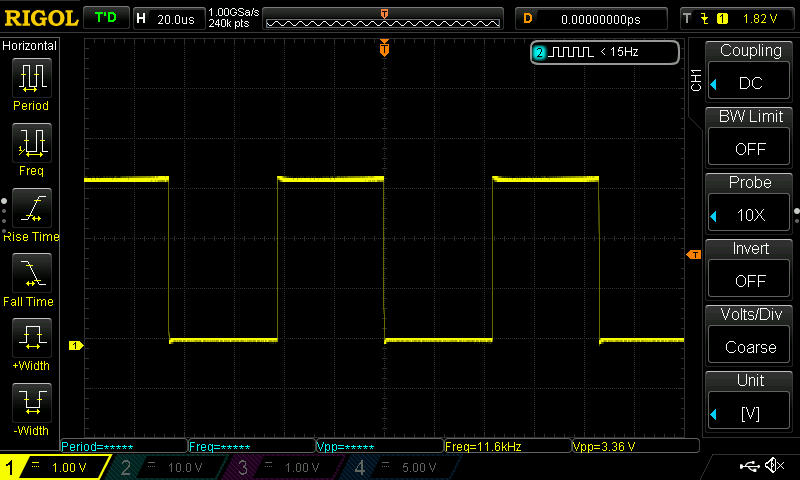
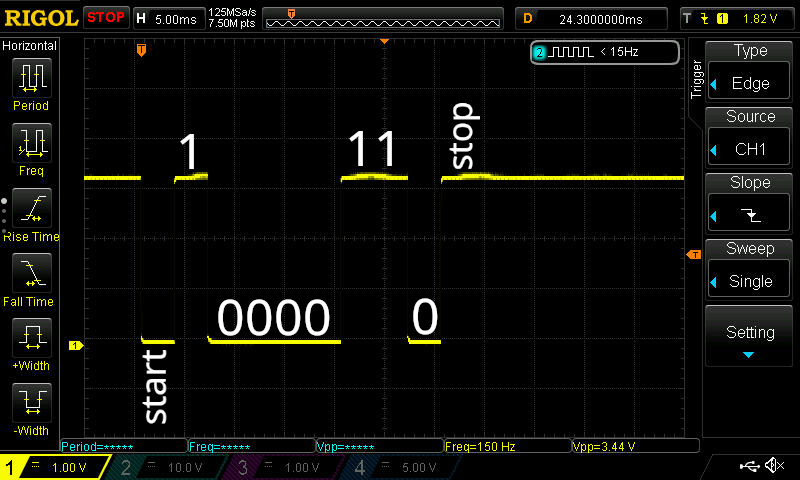
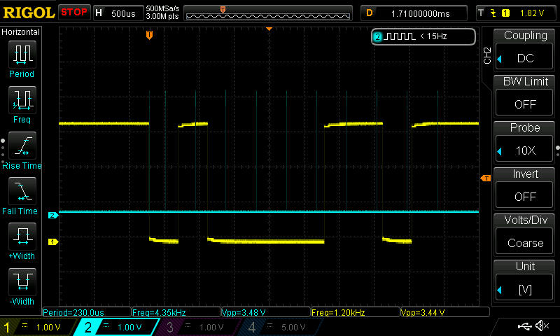
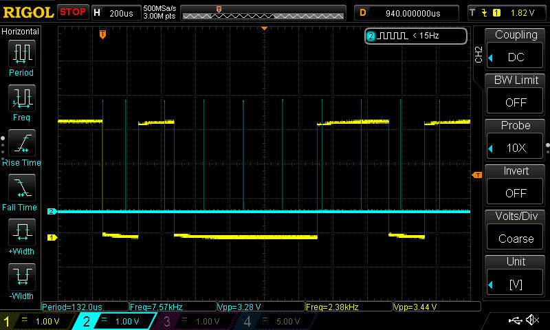
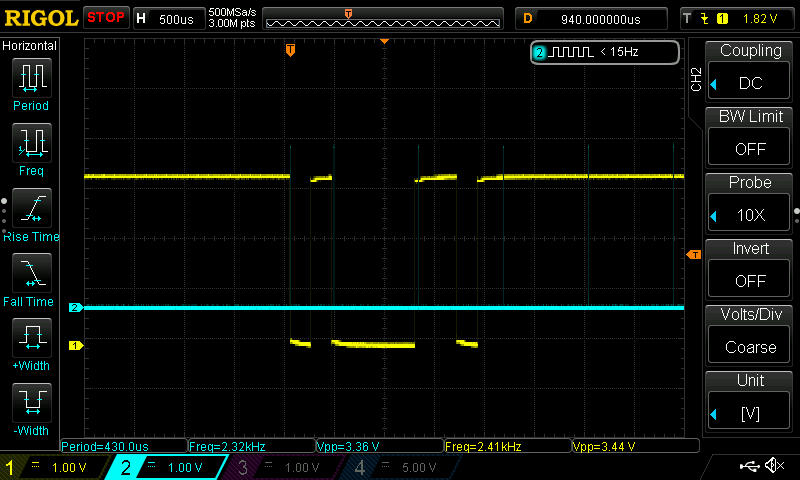
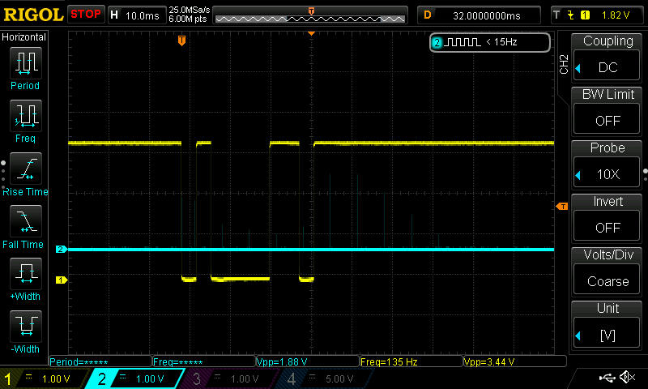
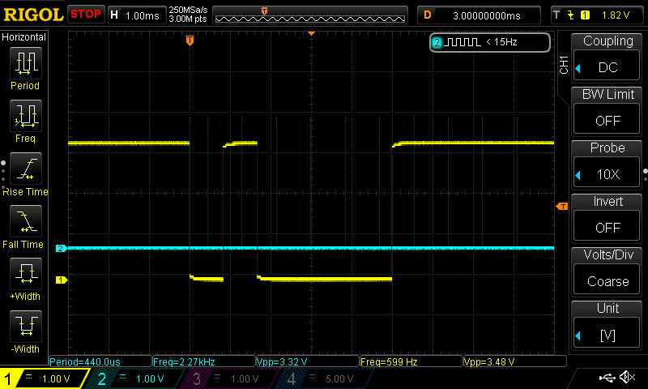
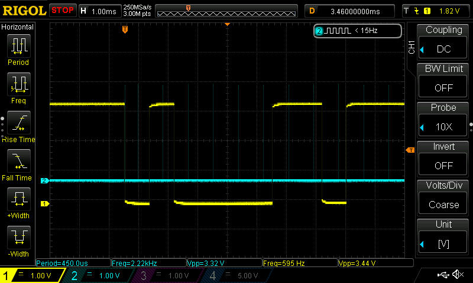

# Electronics for embedded systems - Group 02

> Gabriele Sanna 324140  
> Giulia Solito 329160  
> Ribaudo Alessandro 283309  
> Rong Zhu 327239  

## Laboratory 2

### Project 1: Hello World
```c
int main()
{
	printf("Exercise 1");
	return 0;
}
```
In this project we just set up the environment to print a simple hello world program.

### Project 2: Square wave generator
```c
int main()
{
	int gpio,nticks=10000;
	alt_timestamp_start();
	for( ; ; ){

		gpio=IORD_ALTERA_AVALON_PIO_DATA(NIOS_HEADER_CONN_BASE);

		/*if(gpio & 1 == 1){
			IOWR_ALTERA_AVALON_PIO_DATA(NIOS_HEADER_CONN_BASE,gpio&(!0b01)); // write 0
		}
		else
		{
			IOWR_ALTERA_AVALON_PIO_DATA(NIOS_HEADER_CONN_BASE,gpio|0b01); // write one
		}*/

		IOWR_ALTERA_AVALON_PIO_DATA(NIOS_HEADER_CONN_BASE,gpio^(0b01));
		int starting_timestamp=alt_timestamp();

		while(alt_timestamp()-starting_timestamp < nticks) { /* Do nothing */ }

	}

  return 0;
}
```
This code generates a square wave on the first pin of GPIO. It reads the value of the whole GPIO register, and then toggles the value of the LSB using the XOR operator with the mask `0b1`. This way, all bits except of the LSB are left untouched, while the LSB is toggled.  
Alternatively, we could also achieve the same result by reading the LSB and evaluating its value with an `if/else` statement.

In order to obtain a time delay, we counted a fixed number of clock cycles inside a while loop.

The resulting waveform is a clean square wave, as shown in [Figure 1](#figure-1)


### Project #3: UART signal on the oscilloscope

We sent an `a` character through PuTTY: its ASCII code is 97, that in binary is `01100001`. As we can observe from the picture [Figure 2](#figure-2), the data is correctly transmitted. On the oscilloscope they appear to be in reverse order because the oscilloscope time axis is oriented to the right, while the data are transmitted from the LSB to the MSB


### Project  #4: Software UART receiver

```c

#define BAUD_RATE 1200
#define NBIT 8
#define NSTOPBIT 1

#define NOPARITY 0
#define EVENPARITY 1
#define ODDPARITY 2
#define PARITY NOPARITY


//#define READ_BIT() IORD_ALTERA_AVALON_PIO_DATA(NIOS_UARTRX_BASE) & 0b1;// IOWR_ALTERA_AVALON_PIO_DATA(NIOS_HEADER_CONN_BASE,1); IOWR_ALTERA_AVALON_PIO_DATA(NIOS_HEADER_CONN_BASE,0)


#define READ_BIT() (IORD_ALTERA_AVALON_PIO_DATA(NIOS_UARTRX_BASE) & 0b1)

#define PULSE() IOWR_ALTERA_AVALON_PIO_DATA(NIOS_HEADER_CONN_BASE,1); IOWR_ALTERA_AVALON_PIO_DATA(NIOS_HEADER_CONN_BASE,0)

#define WAIT_CLOCK_CYCLES(nticks) while(alt_timestamp()-starting_timestamp < nticks) { /* Do nothing */ }; starting_timestamp = alt_timestamp()

#define READ_AND_APPEND_BIT(var) var = var<<1; var = var | READ_BIT()

int main()
{

	IOWR_ALTERA_AVALON_PIO_DATA(NIOS_HEADER_CONN_BASE,0);
	printf("Project #4: UART decoder.\n");
	
	uint ticks_per_second = alt_timestamp_freq();
	uint ticks_per_bit = ticks_per_second / BAUD_RATE;
	uint ticks_per_half_bit = ticks_per_bit / 2;
	uint starting_timestamp;
	//uint total_bit = 1 + NBIT + (PARITY != 0 ? 1 : 0) + NSTOPBIT;

#if (PARITY != NOPARITY)
	int parity = 0;
#endif

	uint stop_bits = ~0; // all ones: this way, at the end if it still is all ones it means it's correct
	int rx_value[NBIT]; // is this a char or an int?

	printf("Initialization completed: starting now waiting waiting loop.\n");

	// starting bit: transition high to low
	alt_timestamp_start(); // this is counting clock cycles
	//starting_timestamp = alt_timestamp();
	for(;;){
		stop_bits = ~0; // all ones: this way, at the end if it still is all ones it means it's correct
		//rx_value = 0;

		while(READ_BIT()) { /* do nothing */ }
		PULSE();

		starting_timestamp = alt_timestamp();
		// starting HIGH to LOW transition happened!

		// start timer


		// wait for half a bit time and check if the starting bit is still LOW: if not, an error occourred
		WAIT_CLOCK_CYCLES(ticks_per_half_bit);
		if(READ_BIT()) {
			// an error occurred! print an error and terminate
			printf("ERROR: starting bit changed value in half a bit time! Exiting...\n");
			return 1;
		}
		PULSE();

		// now wait for one bit time and read the next value
		//WAIT_CLOCK_CYCLES(ticks_per_bit);
		// rx_value += READ_BIT(); // append bit
		// rx_value = rx_value | READ_BIT(); // append bit - alternate way: which one is faster?
		// rx_value<<1; // shift left

	//for(uint i=1; !(i & (1<<NBIT)); (i<<1)){ // check
	for(int i=NBIT-1; i>=0; i--){ // alternate way: which one is faster?
			// repeat NBIT times
			WAIT_CLOCK_CYCLES(ticks_per_bit);
			//READ_AND_APPEND_BIT(rx_value);
			rx_value[i] = READ_BIT();
			PULSE();
	}
	#if (PARITY == ODDPARITY || PARITY == EVENPARITY)
		WAIT_CLOCK_CYCLES(ticks_per_bit);
		parity = READ_BIT();
		// we will check for the correctness of the parity at the end of the communication
	#endif

		// read stop bits
		for(uint i=0; i<NSTOPBIT; i++){
			// repeat NSTOPBIT times
			WAIT_CLOCK_CYCLES(ticks_per_bit);
			READ_AND_APPEND_BIT(stop_bits);
			PULSE();
		}

		// communication ended
		// now check for parity and for stop bits
	#if (PARITY != NOPARITY)
		// check parity
		// parity will be toggled for each '1'
		// so for example, if the message is "000000001" and parity bit is '1', at the end it will be '0':
		// TLDR: at the end, parity=='0' means EVENPARITY, parity=='1' means ODDPARITY
		for(uint i=0; i<NBIT; i++){
			parity ^= (rx_value[i]) & 0b1; // toggle the 0th bit if the rx_value[i] is '1'
		}


		#if (PARITY == EVENPARITY)
			// parity should be '0'
			if(parity){
				printf("ERROR: even parity is wrong! Exiting...\n");
				return 1;
			}
		#endif

		#if (PARITY == ODDPARITY)
			// parity should be '1'
			if(!parity){
				printf("ERROR: odd parity is wrong! Exiting...\n");
				return 1;
			}
		#endif
	#endif

		// check now for stop_bits
		if(stop_bits != (~0)){
			printf("ERROR: stop bits are different from all ones! Exiting...\n %u", stop_bits);
			return 1;
		}

		// if we're here it means that it all went well. Let's print on JTAG_UART the value read, and then start reading the next value

		printf("received value: ");
		for(uint i=0; i<NBIT; i++){ // alternate way: which one is faster?
			printf("%d", rx_value[i]);
		}

		printf("\n");
	}

	return 0;
}
```

To implement a software UART receiver, we defined some macros in order to make the code more readable:
- `READ_BIT()`: reads the GPIO register and extracts the LSB using a mask
- `PULSE()`: generates a really fast pulse on a GPIO used to debug the code with the oscilloscope
- `WAIT_CLOCK_CYCLES(nticks)`: waits until the current timestamp reaches the last saved timestamp plus the number of ticks it has to wait
- `READ_AND_APPEND_BIT(var)`: calls the `READ_BIT()` macro and appends the value read to the specified variable, shifting it left

First of all, we computed some calculations at the beginning of the program, in order to avoid slow operations like the division during the receiving phase. We also started the timestamp timer.  

Then we started waiting for the start bit, reading the input bit until it turns to 1. Then we waited for half a bit time, in order to reach the middle on the interval of the bit time, which is the best place to sample it. We then checked if the value of the start bit was still 0.  
Then we started reading the 8 bits in a `for` loop, placing them inside an array.  
We read the stop bits in a similar way, but instead of saving them to an array we appended them to a "shift" variable, originally containing all ones; This way, if at the end of the transmission it will still contain all ones it will mean that the stop bits were all correct.

At the transmission end, we checked for errors and, if none, printed the received value.

### Project 5: Increasing Baud Rate
We set the baud rate to some common values berween 110 and 2400, and found that the data was received correctly for all these baud rates. In the image [Figure 3](#figure-3) the blue pulse shows the sampling instant.


If we increase the baud rate over 2400 (for instance, 4800) we noticed that the data was received wrongly, and [Figure 4](#figure-4) clearly shows the reason: with a faster baud rate the small errors our code commits measuring time becomes more significant, shifting the sampling instants to the "right", sampling the wrong value.

### Project 6: Incompatible Baud Rates
We tried setting different baud rates in the transmitter and in the receiver to observe how the transmission behaves.
Firstly, we set the TX to a higher baud rate than the RX (4800 TX and 1200 RX), as shown in [Figure 5](#figure-5).
We can see that the sampling rate is too slow, and wrong values are read.
We then tried to set the TX to a lower baud rate than the RX (100 TX and 150 RX), as shown in [Figure 6](#figure-6).
We can see (even if the blue pulses are hard to see due to their duration being way smaller than the baud rates) that the bits are sampled too fast: some values are sampled twice.

We tried then setting different number of transmitted bits on the TX and RX.
Firstly we set the TX number of bits to 7, leaving the RX set to 8 bits. The 7 bit value transmitted was `1100001`, but a wrong `11100001` is received, because the stop bits are read as transmitted ones, as shown in [Figure 7](#figure-7).
We then tried to set the TX number of bits to 8 (as in previous exercises), leaving the RX set to 7 bits. The 8 bit transmitted value was `01100001`. We forgot to take a screenshot of the oscilloscope, so we don't have any evidence of the result, but the expected received value is `1100001`.


### Project 8: Parity check
To check the parity of the transmission, we used the variable `parity` initialized to `0`. The idea is to toggle its value (of the first bit, others are not used) for each `1` received. This way, if its value at the end will be still `0` it means that the number of received ones is even (the variable has been toggled `2n` times).

We tried setting on both transmitter and receiver the same parity, and it all worked well. We then tried setting different parities, and the system failed with the message: 

> ERROR: even parity is wrong! Exiting...


## Figures

### Figure 1


### Figure 2


### Figure 3


### Figure 4


### Figure 5


### Figure 6


### Figure 7


### Figure 8
