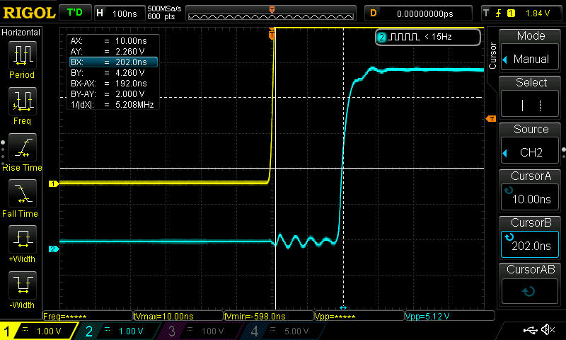
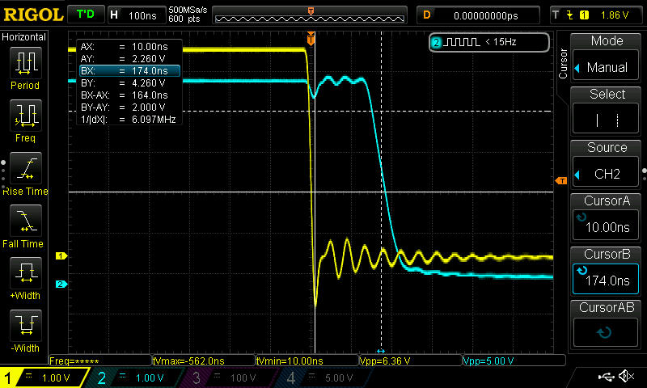
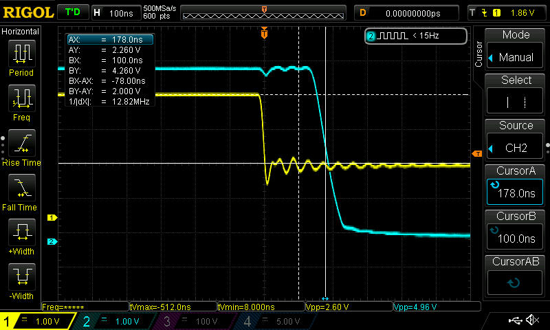
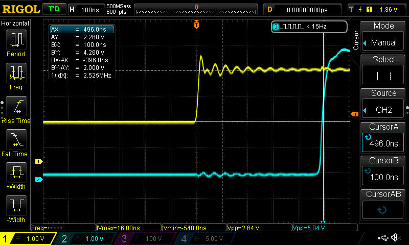
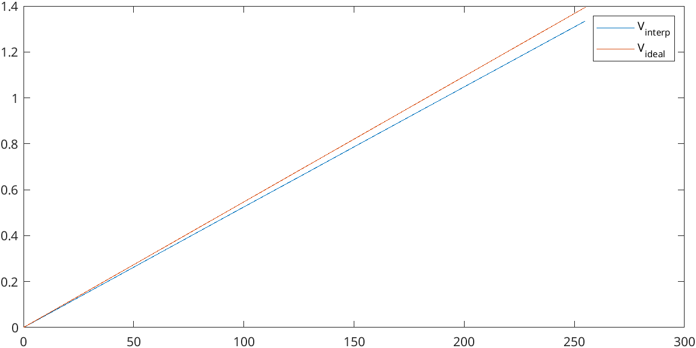
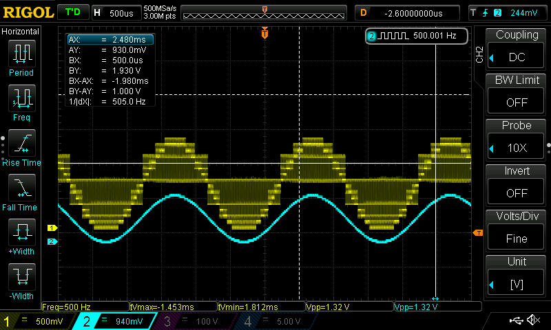

# Electronics for embedded systems - Group 02

> Gabriele Sanna 324140  
> Giulia Solito 329160  
> Ribaudo Alessandro 283309  
> Rong Zhu 327239  

## Laboratory 4

### Step 1: 
In the first step we had to measure the time delays of the LM393 comparator. 
The circuit was mounted in the laboratory according to the instruction.
We set one input of the comparator to 2.5 V and applied a square wave between 0 and 5 V at frequency 50kHz using the signal generator, in order to measure the delays of the falling and rising edges, as shown in Figure 1 and Figure 2. Then we repeated the experiment with a square wave oscillating between 0V and 2V, as shown in Figure 3 and Figure 4. The measured results are the following:

@ 5V:  
    $t_{d_{rising}} = 202 ns$  
    $t_{d_{falling}} = 174 ns$

@ 2V:  
    $t_{d_{rising}} = 496 ns$  
    $t_{d_{falling}} = 178 ns$

### Step 2
In the second step we had to measure the output DAC voltage in different conditions using the digital voltmeter and using the `dac_test` VHDL entity to control the DAC.
The different configurations were 32, because only the five most significant bits could be changed while the last three significant bits were hardwired to 0.   
<!--In the ADV7123 datasheet we found that the maximum output current obtained for an input equal to $2^{10}-1 = 1023$ is: 

$I_{max} = 8.627 \frac{V_{ref}}{R_{set}} = 8.627 \frac{ 1.235 V}{560 \Omega} = 17.62 mA$ 

Therefore we evaluated the ideal transfer function of the DAC: $V_{out_i} = G \; D = \frac{I_{max} R}{1023} D = 1.29 mV \cdot D$. 

The best linear approximation we came up with is: $V_{out_a} = V_{off} + V_{gain} \cdot D = 0.438 mV + 1.288 mV \cdot D$. 

TODO check

 --> 

| in |   V   |
| -- | ----- |
|0   |0 V    |
|32  |0.168 V|
|64  |0.336 V|
|96  |0.504 V|
|128 |0.671 V|
|160 |0.839 V|
|192 |1.006 V|
|224 |1.173 V|
|255 |1.335 V|

The ideal transfer function is:  
$V_{ideal} = D \cdot \frac{V_{OH}}{2^N_{bit}} = D \cdot \frac{1.4 V}{n^8} = D \cdot 5.46875 mV$, with zero offset.

The linear interpolation of the measured values gives instead:  
$V_{interp} = D \cdot 5.2mV + 0.74mV$. Figure 5 shows the plot of the two lines.

### Step 3
In the last step we flashed the `sar_full` entity on the board. To calculate the maximum frequency for the SAR, we considered the maximum measured delay, and we chose a frequency so that the clock period is at least 5 times greater than the maximum delay:

$t_{clk} \ge 5 \cdot 496 ns \simeq 2.5 \mu s \Rightarrow f_{clk} \le 0.4 MHz$  

$f_{clk} = \frac{50 MHz}{DIVISOR + 1} = 0.4 MHz \Rightarrow DIVISOR = 124_{10} = 01111100_2$

However, the four LSBs are hardwired to 0, so the actual divisor we can input is $0111[0000]_2$.

We then proceeded to measure voltage values from 0 to 1.3 V using 4 and 5 and 7 bits, and filled with the results the table below:

| Input voltage | 7 bits | 5 bits | 4 bits |
|---------------|--------|--------|--------|
|1.3V|F4|F0|F0|
|1.2V|E0|E0|E0|
|1.1V|CE|C8|C0|
|1.0V|BA|BB|B0|
|0.9V|A6|A0|A0|
|0.8V|94|90|90|
|0.7V|88|80|80|
|0.6V|6E|68|60|
|0.5V|5A|58|50|
|0.4V|48|48|40|
|0.3V|34|30|30|
|0.2V|22|20|20|
|0.1V|0E|08|00|
|0V  |00|00|00|

As last experiment, we connected the signal generator to the ADC, generating a sinusoidal wave with an amplitude of 1.25V, an offset of 625mV and a frequency of 500Hz. Using the oscilloscope we verified that the DAC output follows the input waveform, as shown in Figure 6:

Figure 1

Figure 2

Figure 3

Figure 4

Figure 5

Figure 6